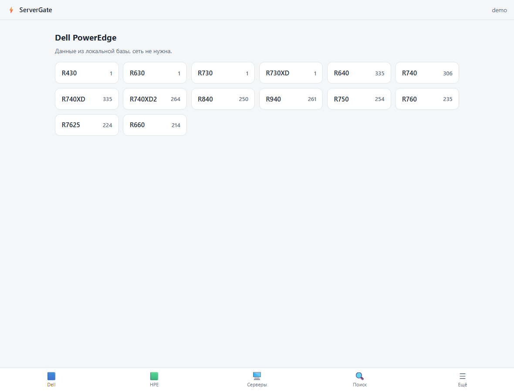
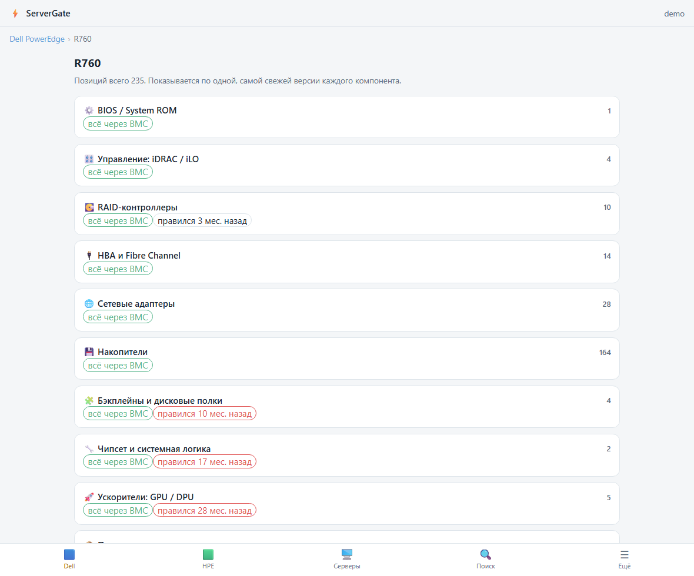
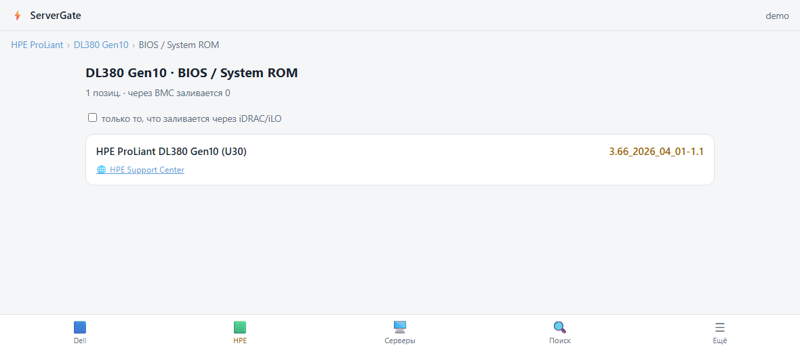
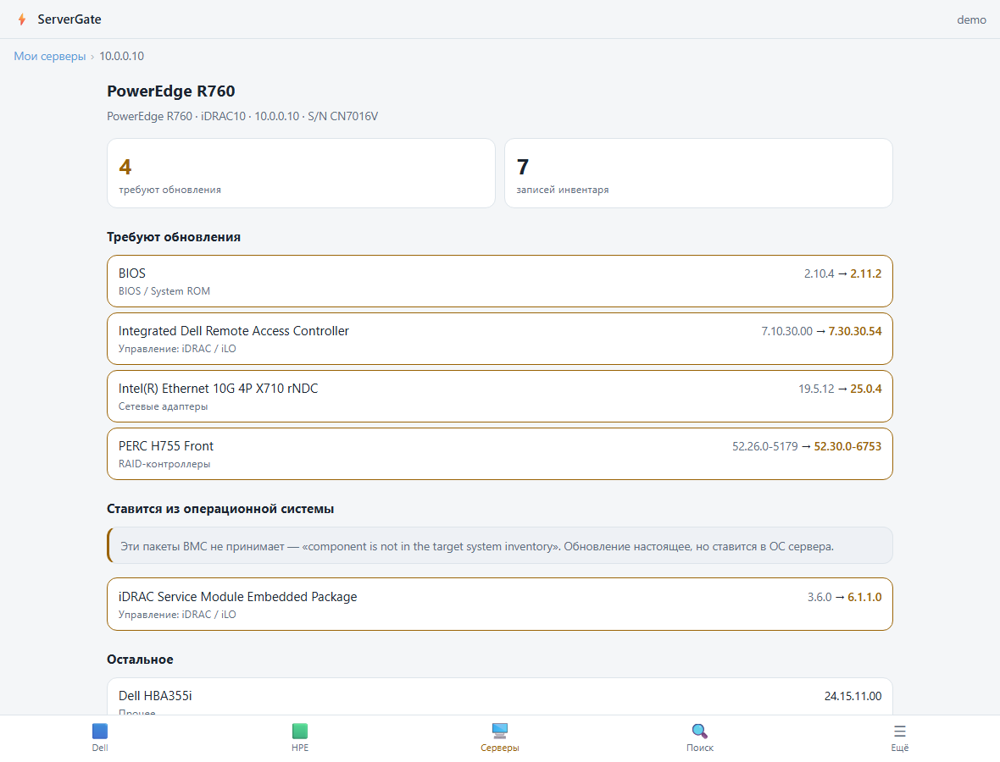
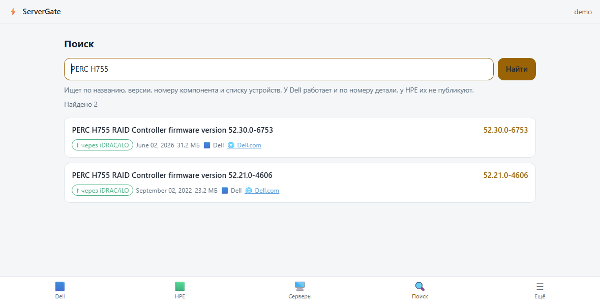
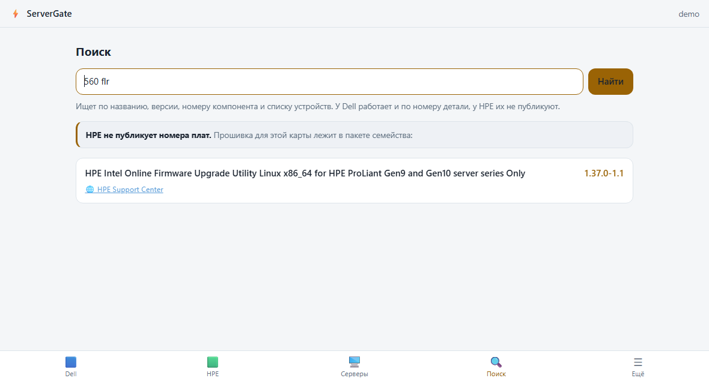
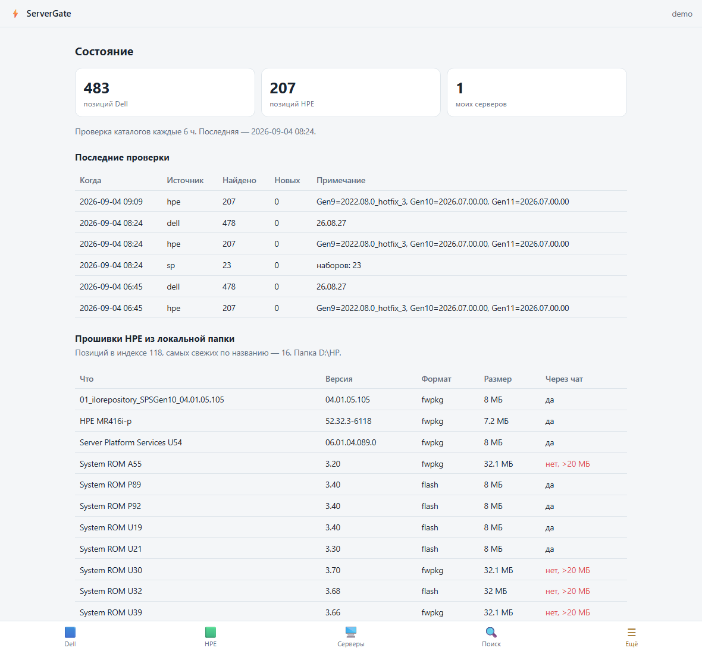
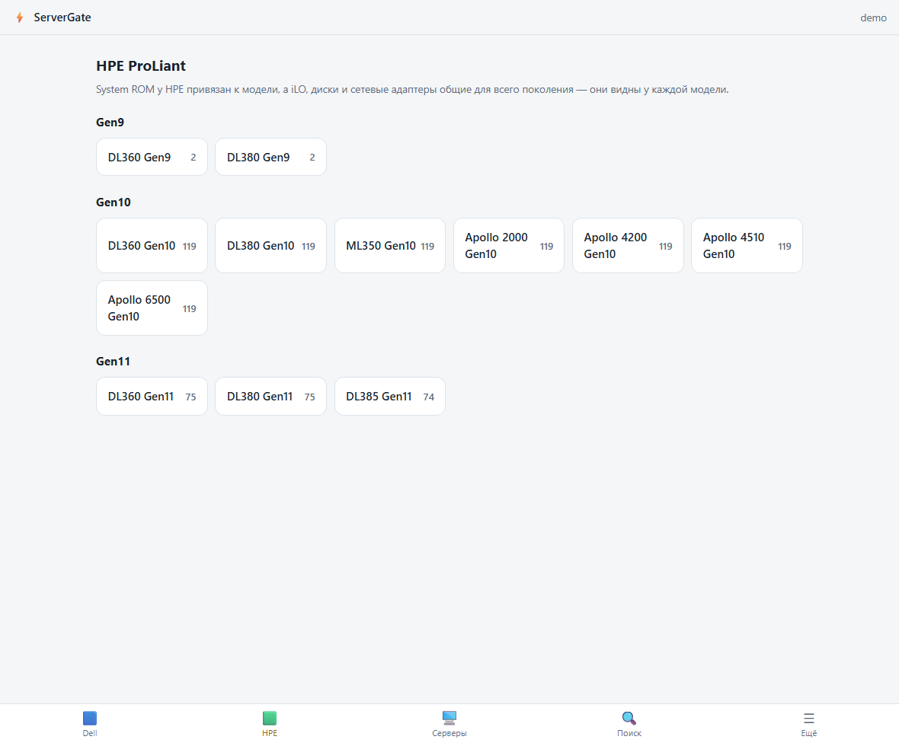

# Server Firmware Monitoring

### Мониторинг, инвентаризация и контроль прошивок Dell PowerEdge и HPE ProLiant

Система следит за обновлениями серверных прошивок, хранит локальный каталог, опрашивает оборудование через Redfish и показывает, какие компоненты требуют внимания.

> Это демонстрационная витрина проекта. Здесь представлены только обзор возможностей и обезличенные изображения интерфейса. Исходный код, рабочие конфигурации, прошивки, образы и ссылки на скачивание не публикуются.

## Задача

В смешанном парке серверов версии BIOS, BMC, RAID-контроллеров, сетевых карт и накопителей приходится сверять с разными каталогами производителей. Ситуация усложняется, когда контур управления оборудованием изолирован от интернета.

Система объединяет этот процесс:

1. Получает и нормализует каталоги Dell и HPE.
2. Отбирает данные только для используемых моделей серверов.
3. Сохраняет каталог локально для работы без доступа к внешней сети.
4. Опрашивает iDRAC и iLO через Redfish.
5. Сравнивает установленные версии с доступными релизами.
6. Разделяет настоящие обновления, актуальные компоненты и пакеты, устанавливаемые из операционной системы.
7. Показывает результат в Telegram и в локальном веб-интерфейсе.

## Последнее обновление

Актуальная версия подготовлена 4 сентября 2026 года. В неё вошли:

- локальный веб-интерфейс для каталогов, поиска, серверных отчётов и состояния системы;
- адаптивное отображение на компьютере и мобильном устройстве;
- подготовленная интеграция с Telegram Mini App;
- поиск прошивок HPE по номеру платы и названию семейства;
- уточнённое сопоставление сетевых адаптеров HPE с пакетами прошивок;
- улучшенное восстановление понятных названий компонентов из метаданных пакетов;
- автозапуск и контроль фонового процесса на рабочей станции;
- дополнительные проверки доступа и защита локальных данных.

## Каталоги оборудования

Каталог разбит по производителям, моделям и типам компонентов: BIOS, iDRAC/iLO, RAID, HBA, сетевые адаптеры, накопители, бэкплейны, чипсет и ускорители.

| Модели Dell PowerEdge | Разделы выбранной модели |
|---|---|
|  |  |

Для каждой позиции отображаются версия, дата, тип компонента и возможность обновления через контроллер управления. Витрина не содержит файлов прошивок и прямых ссылок на их получение.

## Отчёт по серверу

После опроса оборудования система формирует понятный отчёт по состоянию прошивок:

- что требует обновления;
- что уже актуально;
- что установлено новее локального каталога;
- какие компоненты невозможно надёжно сопоставить;
- какие пакеты устанавливаются из операционной системы, а не через BMC.

## Поиск

Поиск работает по названию, версии, номеру компонента и списку поддерживаемых устройств. Для Dell учитываются опубликованные номера деталей.

У HPE один пакет часто обслуживает целое семейство оборудования, а каталожный номер платы не публикуется в метаданных. В обновлённой версии система распознаёт распространённые обозначения адаптеров и показывает соответствующий пакет семейства.

## Состояние системы

Отдельный экран показывает объём локальных каталогов, результаты последних проверок, подключённые серверы и доступные локальные материалы. Это позволяет контролировать актуальность данных даже в закрытом контуре.

## Поддерживаемое оборудование

Проект рассчитан на парк Dell PowerEdge поколений 13G–16G и HPE ProLiant Gen9–Gen11, включая стоечные, универсальные и высокоплотные платформы.

| Dell PowerEdge | HPE ProLiant |
|---|---|
| R430, R630, R730, R730XD, R640, R740, R740XD, R740XD2, R840, R940, R750, R760, R7625, R660 | DL360, DL380, DL385, ML350 и Apollo соответствующих поколений |

## Дополнительные возможности

- уведомления о новых версиях прошивок в Telegram;
- история изменений каталогов;
- контроль питания, температур, блоков питания и событий BMC;
- безопасное хранение учётных данных контроллеров;
- подтверждение потенциально опасных действий пользователем;
- журналирование операций;
- формирование наборов обновлений для выбранных моделей;
- работа в management-сети без прямого доступа серверов в интернет;
- единая логика данных для Telegram и локального веб-интерфейса.

## Принципы безопасности

- Рабочие токены, адреса серверов, пароли BMC и локальная база не публикуются.
- Веб-интерфейс работает в режиме просмотра.
- Управляющие операции выполняются отдельно и требуют явного подтверждения.
- Доступ ограничивается разрешёнными пользователями.
- Присланные файлы проверяются по содержимому, а не только по расширению.
- Демонстрационные изображения не содержат данных реального оборудования.

## Формат решения

Основной интерфейс работает через Telegram-бота. Локальное веб-приложение предоставляет удобный просмотр каталогов и отчётов, а обмен с iDRAC и iLO выполняется через Redfish. Каталоги и результаты проверок хранятся локально, поэтому управление серверным парком не зависит от постоянного доступа оборудования в интернет.

---

Все адреса, серийные номера, имена пользователей и показатели на изображениях являются демонстрационными.
